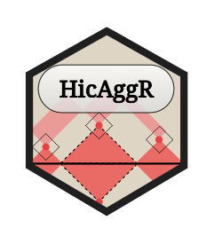

<!-- README.md is generated from README.Rmd. Please edit that file -->

```{r, include = FALSE}
knitr::opts_chunk$set(
  collapse = TRUE,
  comment = "#>",
  fig.path = "man/figures/README-",
  out.width = "100%"
)
```

# HicAggR <a href='https://cuvierlab.github.io/HicAggR/'></a>

<!-- badges: start -->
[](https://github.com/CuvierLab/HicAggR/actions/workflows/R-CMD-check.yaml)
[](https://app.codecov.io/gh/CuvierLab/HicAggR?branch=master)
<!-- badges: end -->

This package provides a set of functions useful in the analysis of 3D genomic interactions.
It includes the import of standard HiC data formats into R and HiC normalisation procedures.
The main objective of this package is to improve the visualization and quantification of the analysis of HiC contacts through aggregation.


## Installation

Development version is avalaible from [GitHub](https://github.com/):

``` r
remotes::install_github("CuvierLab/HicAggR")
```

## Documentation  

[HicAggR](https://cuvierlab.github.io/HicAggR/)
