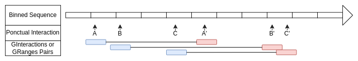
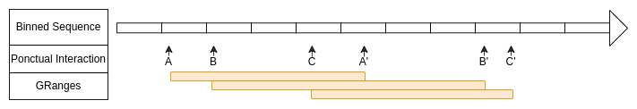
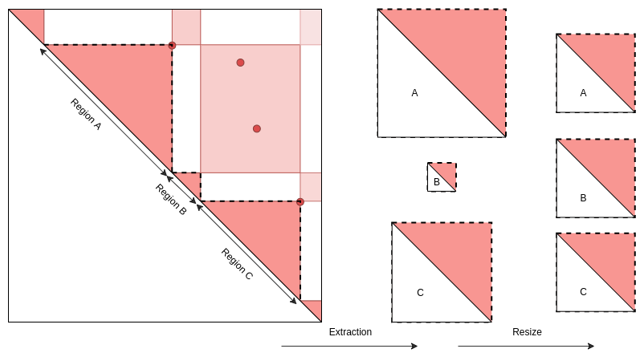
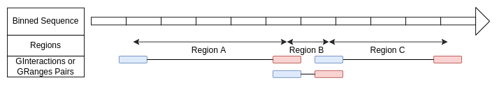
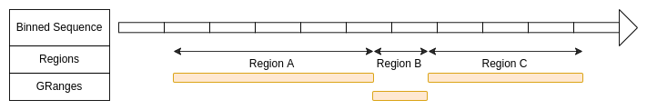
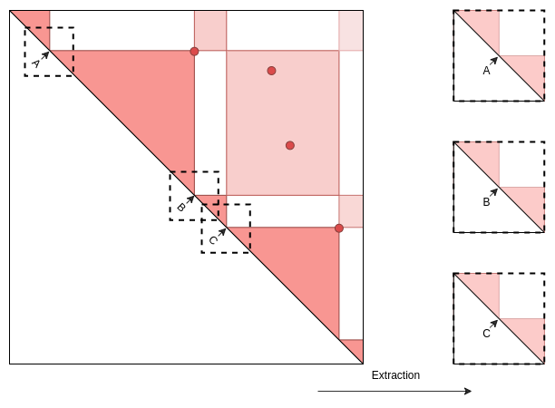
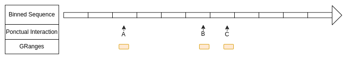
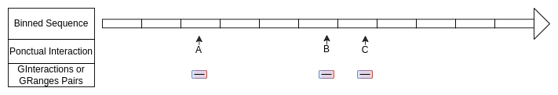
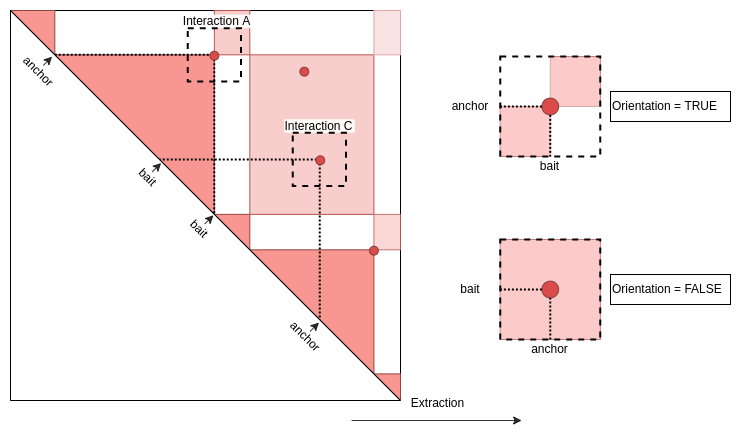
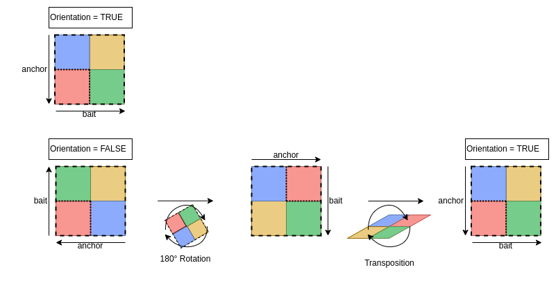

<style>
body {
text-align: justify}
</style>
```{css, echo=FALSE}
pre {
    max-height: 300px;
    overflow-y: auto;
}
pre[class] {
    max-height: 300px;
}
```
```{css, echo=FALSE}
.scroll-100 {
    max-height: 100px;
    overflow-y: auto;
    background-color: inherit;
}
```
```{r, echo = FALSE, message = FALSE}
knitr::opts_chunk$set(collapse = TRUE, comment = "#>")
options(tibble.print_min = 4L, tibble.print_max = 4L)
```

This package provides a set of functions useful in the analysis of 3D genomic interactions.
It includes the import of standard HiC data formats into R and HiC normalisation procedures.
The main objective of this package is to improve the visualization and quantification of the analysis of HiC contacts through aggregation.

# Requirements

## Installation
```{r, eval = FALSE}
remotes::install_github("CuvierLab/HicAggR")
```

## Load library
```{r, eval = TRUE, message = FALSE}
library(HicAggR)
```  

___
# Test dataset

## Description

Data were obtained from *Drosophila melanogaster S2 cells*.  
1. HiC test dataset Directly downloaded from the [4DN](https://data.4dnucleome.org) platform.  
* Control Condition  
* Heat Shock Condition  
2. Genomic coordinates:  
* ChIPseq peaks of Beaf-32 protein in wild type cells ([GSM1278639](https://www.ncbi.nlm.nih.gov/geo/query/acc.cgi?acc=GSM1278639)).  
* Reference annotation data for TSS from the UCSC database.  
* Topologically associating domains (TAD) annotations were defined as described ([F. Ramirez, 2018](https://doi.org/10.1038/s41467-017-02525-w)).  

## 1. Genomic 3D structure
For a test, please download HiC data in .hic format (Juicer) and .mcool format (HiCExplorer). Examples for each format are provided below.

### Temp directory preparation
```{r, eval = TRUE, message = FALSE}
options(timeout = 3600)
temp.dir <- file.path(tempdir(), "HIC_DATA")
dir.create(temp.dir)
```

### Control condition (.hic File)
```{r, eval = TRUE, message = FALSE}
Hic.url <- "https://4dn-open-data-public.s3.amazonaws.com/fourfront-webprod/wfoutput/7386f953-8da9-47b0-acb2-931cba810544/4DNFIOTPSS3L.hic"
HicOutput.pth <- file.path(temp.dir, "Control_HIC.hic")
download.file(Hic.url, HicOutput.pth, method = 'curl', extra = '-k')
```

### Heat shock condition (.mcool File)
```{r, eval = TRUE, message = FALSE}
Mcool.url <- "https://4dn-open-data-public.s3.amazonaws.com/fourfront-webprod/wfoutput/4f1479a2-4226-4163-ba99-837f2c8f4ac0/4DNFI8DRD739.mcool"
McoolOutput.pth <- file.path(temp.dir, "HeatShock_HIC.mcool")
download.file(Mcool.url, McoolOutput.pth, method = "curl", extra = "-k")
```

## 2 Genomic location and annotation data
These kind of data can be imported in R with [rtracklayer](https://bioconductor.org/packages/release/bioc/html/rtracklayer.html) package.

### ChIPseq peaks of Beaf-32 protein
```{r, eval = TRUE}
data("Beaf32_Peaks.gnr")
```
<details>  
<summary>View</summary>  
```{r, echo = FALSE, eval = TRUE, message = FALSE}
Beaf_Peaks.dtf <- Beaf32_Peaks.gnr |> as.data.frame() |> head(n=3L)
Beaf_Peaks.dtf <- Beaf_Peaks.dtf[,-c(4)]
knitr::kable(Beaf_Peaks.dtf[,c(1:4,6,5)],
    col.names = c(
        "seq","start","end","strand",
        "name","score"),
    align  = "rccccc",
    digits = 1
)
```
</details>  

### TSS annontation
```{r, eval = TRUE}
data("TSS_Peaks.gnr")
```
<details>
<summary>View</summary>
```{r, echo = FALSE, eval = TRUE, message = FALSE}
TSS_Peaks.dtf <- TSS_Peaks.gnr |> as.data.frame() |> head(n=3L)
TSS_Peaks.dtf <- TSS_Peaks.dtf[,-c(4)] 
knitr::kable(TSS_Peaks.dtf[,c(1:4,6,5)],
    col.names = c(
        "seq","start","end","strand",
        "name","class"),
    align  = "rccccc"
)
```
</details>  

### TADs annotation
```{r, eval = TRUE}
data("TADs_Domains.gnr")
```
<details>  
<summary>View</summary>  
```{r, echo = FALSE, eval = TRUE, message = FALSE}
domains.dtf <- TADs_Domains.gnr |> as.data.frame() |> head(n=3L)
domains.dtf <- domains.dtf[,-c(4)]
knitr::kable(domains.dtf[,c(1:4,7,5,6)],
    col.names = c(
        "seq","start","end","strand",
        "name","score","class"),
    align  = "rcccccc"
    )
```
</details>  

## Additional genome informations
Required genomic informations used by the functions during the entire pipeline are a data.frame containing chromosomes names and sized and the binSize, corresponding to the HiC matrices at the same resolution.

```{r, eval = TRUE}
seqlengths.num <- c('2L'=23513712, '2R'=25286936)
chromSize.dtf  <- data.frame(
    seqnames   = names(seqlengths.num ), 
    seqlengths = seqlengths.num
    )
binSize.num <- 1000
```

___
# Import HiC

## Import
HicAggR can import HiC data stored in the main formats: .hic, .cool, .mcool, .h5, .hdf5. The pacakage imports only the raw counts in R. Therefore it is necessary to perform the balancing and observed/expected correction steps.
```{r, eval = TRUE, message = FALSE}
HiC_Ctrl.cmx_lst <- ImportHiC(
        file.pth    = HicOutput.pth,
        res.num     = 1000,
        chrom_1.chr = c("2L", "2L", "2R"),
        chrom_2.chr = c("2L", "2R", "2R")
)
```

```{r, eval = TRUE, message = FALSE}
HiC_HS.cmx_lst <- ImportHiC(
        file.pth    = McoolOutput.pth,
        res.num     = 1000,
        chrom_1.chr = c("2L", "2L", "2R"),
        chrom_2.chr = c("2L", "2R", "2R")
)
```

## Balancing
The balancing is done such that every bin of the matrix has approximately the same number of contacts within the contactMatrix.

```{r, eval = TRUE, results = FALSE}
HiC_Ctrl.cmx_lst <- BalanceHiC(HiC_Ctrl.cmx_lst)
HiC_HS.cmx_lst <- BalanceHiC(HiC_HS.cmx_lst)
```

### Tips

1. In the interaction.type parameter it is required to define "cis" or "trans". Then the function will return only ContactMatrices in the corresponding category ("cis" or "trans"). All other categories will be removed from the result.
2. In the interaction.type parameter if you type c("cis","trans") the function will normalize separetly "cis" or "trans". If you type "all" the function will normalize "cis" and "trans" matrices together.


## Observed/Expected Correction
To correct effects due to genomic distance the matrix is corrected by the expected values for each genomic distance.
```{r, eval = TRUE, results = FALSE}
HiC_Ctrl.cmx_lst <- OverExpectedHiC(HiC_Ctrl.cmx_lst)
HiC_HS.cmx_lst <- OverExpectedHiC(HiC_HS.cmx_lst)
```

### Tips
1. After runing `OverExpectedHiC` function, expected counts can be plotted as a function of genomic distances with tibble by taking the expected attributes.

## HiC data format: ContactMatrix list structure 
Each element of the list corresponds to a ContactMatrix object (dgCMatrix object, sparse matrix format) storing contact frequencies for one chromosomes (cis-interactions, ex: "2L_2L") or between two chromosomes (trans-interactions, ex: "2L_2R").
HiC data format is based on [InteractionSet](https://www.bioconductor.org/packages/release/bioc/vignettes/InteractionSet/inst/doc/interactions.html) and [Matrix](https://cran.r-project.org/web/packages/Matrix/Matrix.pdf) packages.
```{r, eval = TRUE}
str(HiC_Ctrl.cmx_lst,max.level = 4)
#>
```
The list has the attributes described below. These attributes are accessible via:
```{r, eval = TRUE}
attributes(HiC_Ctrl.cmx_lst)
#>
```

1. **names** : the names of list elements (ContactMatrix).
2. **resolution** : the resolution of the HiC map.  
3. **chromSize** : the size of the chromosomes in the tibble format.   
        - *seqnames* : the sequence name (chromosome name).  
        - *seqlengths* : the sequence length in base pairs.  
        - *dimension* : the sequence length in number of bins. 
4. **matricesKind** : the kind of matrix that composes the list in the tibble format.  
        - *name* : the matrix name. 
        - *type* : interaction type. *"Cis"* for interactions on the same chromosome and *"Trans"* for interactions on different chromosomes.  
        - *kind* : the matrix kind. U for upper triangle matrices, L for lower triangle matrices, NA for rectangular or square matrices.
        - *symmetric* : a boolean that indicates whether the matrix is symmetric (lower triangle identical to upper triangle).  
5. **mtx** : the kind of values in matrix. For exemple observed counts, normalized counts, observed/expected, etc.
6. **expected** : This attribute is related to the `OverExpectedHiC` function. It gives a tibble with the expected counts as a function of genomic distance.

Each contactmatrix in the list have metadata. These are accessible via:
```{r, eval = TRUE}
S4Vectors::metadata(HiC_Ctrl.cmx_lst[["2L_2L"]])
#>
```

1. **name** : the name of the ContactMatrix.
2. **type** : interaction type. *"Cis"* for interactions on the same chromosome and *"Trans"* for interactions on different chromosomes (or arms).  
3. **kind** : the matrix kind. U for upper triangle matrices, L for lower triangle matrices, NA for rectangular or square
4. **symmetric** : a boolean that indicates whether the matrix is symmetric (lower triangle identical to upper triangle).  
5. **resolution** : resolution of the HiC map.  
6. **removedCounts** : A sparse matrix (dgCMatrix) of the removed counts (counts that are below the threshold on rows or columns as described in `BalanceHiC`).
7. **observed** : observed counts of the sparse matrix.
8. **normalizer** : the balancer vector that converts the observed counts into normalized counts. (observed * normalizer = normalized counts).  
9. **mtx** : the kind of values in matrix. For example observed counts, normalized counts, observed/expected, etc.  
10. **expected** : This attributes is related to the `OverExpectedHiC` function. It gives the expected vector that convert the normalized counts into the observed/expected counts (normalized counts / expected = observed/expected).

___
# Indexing
This part of the data corresponds to the positioning data (ChIPseq peaks, genomic features and annotations, genes, etc) on the genome. 
To integrate such annotations with HiC data in 2D matrices, annotations must be processed as followed.

The first step is the indexing of the features. It allows the features to be splitted and grouped into bins corresponding to the HiC bin size.

## Example 1: Anchors from Beaf32 ChIP-seq peaks (bed file)
```{r, message = FALSE, eval = TRUE}
anchors_Index.gnr <- IndexFeatures(
    gRange.gnr_lst        = list(Beaf=Beaf32_Peaks.gnr), 
    constraint.gnr        = TADs_Domains.gnr,
    chromSize.dtf         = chromSize.dtf,
    binSize.num           = binSize.num,
    variablesName.chr_vec = "score",
    method.chr            = "max"
    )
```
<details>  
<summary>View</summary>  
```{r, echo = FALSE, eval = TRUE}
anchors_Index.gnr |>
    as.data.frame() |>
    head(n=3) |>
    knitr::kable()
```
</details>  

## Example 2: Baits from TSS (transcription start sites from UCSC)
```{r, eval = TRUE}
baits_Index.gnr <- IndexFeatures(
    gRange.gnr_lst        = list(Tss=TSS_Peaks.gnr),
    constraint.gnr        = TADs_Domains.gnr,
    chromSize.dtf         = chromSize.dtf,
    binSize.num           = binSize.num,
    variablesName.chr_vec = "score",
    method.chr            = "max"
    )
```
<details>  
<summary>View</summary>  
```{r, echo = FALSE, eval = TRUE}
baits_Index.gnr |>
    as.data.frame() |>
    head(n=3) |>
    knitr::kable()
```
</details>  

## Filter indexed features:
By using features names and bin IDs, it is possible to filter a subset of features.
Example: Subset TSS that are not in the same bin than a Beaf32 peak.
```{r, eval = TRUE}
non_Overlaps.ndx <- NotIn(baits_Index.gnr$bin,anchors_Index.gnr$bin)
baits_Index.gnr <- baits_Index.gnr[non_Overlaps.ndx,]
```
<details>  
<summary>View</summary>  
```{r, echo = FALSE, eval = TRUE}
baits_Index.gnr |>
    as.data.frame() |>
    head(n=3) |>
    knitr::kable()
```
</details>  


## Tips
1. It is possible to index multiple features at the same time by submitting a named list of GRanges. Names given in the list of GRanges can then be used to filter indexed features and pairs.  
2. If constraint.gnr is defined, then anchors and baits will be paired when located within the same region only. If contraint.gnr is NULL, entire chromosomes (or arms) are used as constraints.  
3. When multiple ranges are in a same bin (ex: 3 ChIP-seq peaks in the same 10kb bin), associated numeric variables in metadata (`variablesName.chr_vec`) can be summarized according to the defined method (`method.chr`), Example: Max peak score of the bin is kept in metadata column `score`.  

___
# Search Pairs 

## Pairing
`SearchPairs` function takes as input one or two indexed features and returns all putative pairs within the same constraint (ex: wihtin the same TAD).  
If only one indexed features is defined in indexAnchor.gnr, `SearchPairs` will return symetrical homotypic pairs (A<->A), if indexAnchor.gnr and indexBait.gnr are defined, it will return asymetrical heterotypic pairs (A<->B).

```{r, eval = TRUE}
interactions.gni <- SearchPairs(
        indexAnchor.gnr = anchors_Index.gnr,
        indexBait.gnr   = baits_Index.gnr
        )
```
<details>  
<summary>View</summary>  
```{r, eval = TRUE,  echo = FALSE}
interactions.dtf <- interactions.gni |>
    as.data.frame() |>
    head(n=3L)
interactions.dtf <- interactions.dtf[,-c(4,5,9,10)]
interactions.dtf[,c(1:11,13,12,17,16,18,15,14,20,19,21)] |>
    knitr::kable(
        col.names = c(
            "seq","start","end",
            "seq","start","end",
            "name", "constraint" ,"distance", "orientation", "submatrix.name",
            "name", "bin", "Beaf.name", "Beaf.score", "Beaf.bln",
            "name", "bin", "Tss.name", "Tss.class", "Tss.bln"
        ),
        align  = "rccrccccccccccccccccc",
        digits = 1
    ) |>
    kableExtra::add_header_above(c(
        "Names" = 1,
        "First" = 3,
        "Second" = 3,
        "Interaction"=5,
        "Anchor"=5,
        "Bait"=5)
    ) |>
    kableExtra::add_header_above(c("Ranges" = 7 , "Metadata"=15))
```
</details>


## Tips
1. If `indexBait.gnr` is NULL, `SearchPairs` will return homotypic pairs with `indexAnchor.gnr`.
2. Minimum and maximum distances between pairs anchors can be set. Note that it is also possible tofilter pairs within a specific distance later on.


___
# Extractions

## Case 1: Long-range interactions between two distal anchors.


```{r, eval = TRUE, echo = FALSE}
knitr::include_graphics("images/Extractions_of_LRI.png")
```

### Interactions defined with GInteraction or Pairs of GRanges.
In extracted matrices, the middle of the Y axis corresponds to the center of the first element and interacts with the center of second element in the middle of the X axis.  

```{r, eval = TRUE, echo = FALSE}

```

```{r, eval = FALSE}
interactions_PFmatrix.lst <- ExtractSubmatrix(
    feature.gn         = interactions.gni,
    hic.cmx_lst        = HiC_Ctrl.cmx_lst,
    referencePoint.chr = "pf",
    matriceDim.num     = 41
    )
```

### Interactions defined with GRanges.
The middle of the Y axis corresponds to the start of the range and interacts with the middle of the X axis which corresponds to the end of the range.  

```{r, eval = TRUE, echo = FALSE}

```
```{r, eval = TRUE}
domains_PFmatrix.lst <- ExtractSubmatrix(
    feature.gn         = TADs_Domains.gnr,
    hic.cmx_lst        = HiC_Ctrl.cmx_lst,
    referencePoint.chr = "pf",
    matriceDim.num     = 41
    )
```

## Case 2: Interactions around genomic regions or domains.

In this case, extracted matrices are resized and scaled in order to fit all regions into the same area.

```{r, eval = TRUE, echo = FALSE}

```

### Regions defined with GInteraction object or Pairs of GRanges  
The region's start is defined by the center of the first element and the region's end by the center of the second element.  
```{r, eval = TRUE, echo = FALSE}

```

```{r, eval = TRUE}
interactions_RFmatrix_ctrl.lst  <- ExtractSubmatrix(
    feature.gn         = interactions.gni,
    hic.cmx_lst        = HiC_Ctrl.cmx_lst,
    res.num            = NULL,
    referencePoint.chr = "rf",
    matriceDim.num     = 101
    )
```

### Regions defined with GRanges
The regions are directly defined by the ranges of GRanges object.  

```{r, eval = TRUE, echo = FALSE}

```

```{r, eval = FALSE}
domains_RFmatrix.lst <- ExtractSubmatrix(
    feature.gn         = TADs_Domains.gnr,
    hic.cmx_lst        = HiC_Ctrl.cmx_lst,
    referencePoint.chr = "rf",
    matriceDim.num     = 101,
    cores.num          = 1,
    verbose.bln        = FALSE
    )
```

## Case 3: Interactions along the chromosome axis.

```{r, eval = TRUE, echo = FALSE}

```

### Example to analyse interactions in the context of TADs:
**Step 1:** generate a GRanges object of TAD boundaries by concatenating starts and ends of TADs.
```{r, eval = TRUE}
domains_Border.gnr <- c(
        GenomicRanges::resize(TADs_Domains.gnr, 1, "start"),
        GenomicRanges::resize(TADs_Domains.gnr, 1,  "end" )
) |>
sort()
```
</details>  

**Step 2:** Filter and reduce TAD boundaries GRanges object according to HiC resolution (binSize) + Store TAD names.
```{r, eval = TRUE}
domains_Border_Bin.gnr <- BinGRanges(
    gRange.gnr  = domains_Border.gnr,
    binSize.num = binSize.num,
    verbose.bln = FALSE
    )
domains_Border_Bin.gnr$subname <- domains_Border_Bin.gnr$name
domains_Border_Bin.gnr$name    <- domains_Border_Bin.gnr$bin
```

```{r, eval = FALSE}
domains_Border_Bin.gnr
```
<details>  
<summary>View</summary>  


```{r, eval = TRUE, echo = FALSE}
domains_Border_Bin.dtf <- domains_Border_Bin.gnr |>
    as.data.frame() |>
    head(n=3L)
domains_Border_Bin.dtf <- domains_Border_Bin.dtf[,-c(4)]
knitr::kable(domains_Border_Bin.dtf[,c(1:4,7,5,6,8,9)],
    col.names = c(
        "seq","start","end","strand",
        "name","score", "class","bin","subname"),
    align  = "rcccccccc"
    ) 
```
</details>  

**Step 3:** This defines a GRanges object. In the folowing examples, the same informations is needed in a GInteraction object class.  

```{r, eval = TRUE}
domains_Border_Bin.gni <- InteractionSet::GInteractions(domains_Border_Bin.gnr,domains_Border_Bin.gnr)
```
<details>  
<summary>View</summary>  
```{r, eval = TRUE, echo = FALSE}
domains_Border_Bin.dtf <- domains_Border_Bin.gni |>
    as.data.frame() |>
    head(n=3L)
domains_Border_Bin.dtf <- domains_Border_Bin.dtf[,-c(4,5,9,10)]
domains_Border_Bin.dtf[,c(1,2,3,9,7,8,10,11,4,5,6,14,13,12,15,16)] |>
    knitr::kable(
        col.names = c(
            "seq","start","end","name","score", "class", "bin", "subname",
            "seq","start","end","name","score", "class", "bin", "subname"
        ),
        align  = "rccrccccccccccccccccc",
        digits = 1
    ) |>
    kableExtra::add_header_above(c("First" = 8, "Second" = 8))
```
</details>  
### Ponctual interactions defined with GRanges
Here the start and the end of each ranges are in a same bin.  
```{r, eval = TRUE, echo = FALSE}

```
```{r, eval = FALSE}
border_PFmatrix.lst <- ExtractSubmatrix(
    feature.gn         = domains_Border_Bin.gnr,
    hic.cmx_lst        = HiC_Ctrl.cmx_lst,
    referencePoint.chr = "pf",
    matriceDim.num     = 101
)
```
### Ponctual interactions defined with GInteractions
Here the first (blue on scheme) and the second (red on scheme) elements are the same.  
```{r, eval = TRUE, echo = FALSE}

```
```{r, eval = FALSE}
border_PFmatrix.lst <- ExtractSubmatrix(
    feature.gn         = domains_Border_Bin.gni,
    hic.cmx_lst        = HiC_Ctrl.cmx_lst,
    referencePoint.chr = "pf",
    matriceDim.num     = 101
)
```

## Tips
1. If `res.num` is NULL, the function will atuomatically use the resolution of the `hic.cmx_lst` attributes.
2. referencePoint.chr is automatically set as "pf" if every anchors and baits are on the same bin (see examples).

___
# Filtrations

The modularity of the workflow allows the user to filter interactions, pairs or extracted submatrices at any step of the analysis.
`FilterInteractions` function takes as input either a GInteraction object or a list of submatrices, and a list of targets of choice and a selection function defining how targets are filtered.

## Target list definition:
Target list must be defined by a named list corresponding to the same names of each element  and correspond to the column of the GInteraction (or the attributes "interactions" of the matrices to be filtered).
Then each element must be a character list to match this column or a function that will test each row in the column and return a bolean.

```{r, eval = FALSE}
structureTarget.lst <- list(
    first_colname_of_GInteraction  = c("value"),
    second_colname_of_GInteraction = function(eachElement){min_th<value && value<max_th}
    )
```

Interactions, pairs or extracted submatrices are filtered by metadata elements from GRanges objects used in `SearchPairs`.
Those metadata are stored in the attributes of the list of submatrices that are accessible as follow: 
```{r, eval = FALSE}
attributes(interactions_RFmatrix_ctrl.lst)$interactions
names(S4Vectors::mcols(attributes(interactions_RFmatrix_ctrl.lst)$interactions))
```
<details>  
<summary>View</summary>  

```{r, eval = TRUE, echo = FALSE}
interactions_RFmatrix_ctrl.dtf <- attributes(interactions_RFmatrix_ctrl.lst)$interactions |>
    as.data.frame() |>
    head(n=10L)
interactions_RFmatrix_ctrl.dtf <- interactions_RFmatrix_ctrl.dtf[,-c(4,5,9,10)]
interactions_RFmatrix_ctrl.dtf[,c(1:11,13,12,17,16,18,15,14,20,19,21)] |>
    knitr::kable(
        col.names = c(
            "seq","start","end",
            "seq","start","end",
            "name", "constraint" ,"distance", "orientation", "submatrix.name",
            "name", "bin", "Beaf.name", "Beaf.score", "Beaf.bln",
            "name", "bin", "Tss.name", "Tss.class", "Tss.bln"
        ),
        align  = "rccrccccccccccccccccc",
        digits = 1
    ) |>
    kableExtra::add_header_above(c(
        "Names"=1,
        "First" = 3,
        "Second" = 3,
        "Interaction"=5,
        "Anchor"=5,
        "Bait"=5)
    ) |>
    kableExtra::add_header_above(c("Ranges" = 7, "Metadata"=15))
```
</details>  

### Example of target list:

In this example, Pairs will be filtered on anchor.Beaf.name, bait.Tss.name, name (which correponds to the submatrix IDs) and distance.
The aim of the example is to filter Pairs or submatrices that have:  

1. "Beaf32_8" and "Beaf32_15" in **anchor.Beaf.name**  
2. "FBgn0031214" and "FBgn0005278" in **bait.Tss.name**  
3. **distance** exactly equal to 14000 or 3000  
And to exclude Pairs or submatrices that have:
4. "2L:74_2L:77" in **name**  

```{r, eval = TRUE}
target.lst <- list(
    anchor.Beaf.name = c("Beaf32_8","Beaf32_15"),
    bait.Tss.name    = c("FBgn0031214","FBgn0005278"),
    name             = c("2L:74_2L:77"),
    distance         = function(columnElement){
        return(14000==columnElement || columnElement == 3000)
        }
    )
```

## Selection Function definition:
The selection function defines which operations (union(), intersect(), setdiff()...) are used to filter the set of Pairs with target elements.
For more examples, see *Selection function tips and examples* section.

### Example of selection function according to the example target

Following the example case defined in target.lst

```{r, eval = TRUE}
selection.fun = function(){
    Reduce(intersect, list(anchor.Beaf.name, bait.Tss.name ,distance) ) |>
    setdiff(name)
    }
```

## Filtration with selection

### Example of GInteraction object filtration  
With a GInteraction object as input, `FilterInteractions` will return the indices of filtered elements.

With the target.lst and selection.fun defined above:
```{r, eval = TRUE}
FilterInteractions(
    interarctions.gni = attributes(interactions_RFmatrix_ctrl.lst)$interactions,
    target.lst        = target.lst,
    selection.fun     = selection.fun
    )
```

### Example of Matrices list filtration
With a matrices list as input, `FilterInteractions` will return the filtered matrices list, with updated attributes.

With the target.lst and selection.fun defined above:
```{r, eval = TRUE}
filtred_interactions_RFmatrix_ctrl.lst <- FilterInteractions(
    matrices.lst  = interactions_RFmatrix_ctrl.lst,
    target.lst    = target.lst,
    selection.fun = selection.fun
    )
```

## Specific case 1: Only one target (and therefore no selection needed)
For example, to filter the top 100 first elements, select the top 100 first names
```{r, eval = TRUE}
first100_target.lst = list(
    submatrix.name = names(interactions_RFmatrix_ctrl.lst)[1:100]
    )
```

### GInteraction filtration
```{r, eval = TRUE}
FilterInteractions(
    interarctions.gni = attributes(interactions_RFmatrix_ctrl.lst)$interactions,
    target.lst        = first100_target.lst,
    selection.fun     = NULL
    ) |> head()
```
### Matrices list filtration
```{r, eval = TRUE}
first100_interactions_RFmatrix_ctrl.lst <- FilterInteractions(
    matrices.lst  = interactions_RFmatrix_ctrl.lst,
    target.lst    = first100_target.lst,
    selection.fun = NULL
    )
attributes(first100_interactions_RFmatrix_ctrl.lst)$interactions
```
**Warning!** A selection of some matrices removes attributes.
```{r, eval = TRUE}
attributes(interactions_RFmatrix_ctrl.lst[1:20])$interactions
```

## Specific case 2: Sampling
```{r, eval = TRUE}
nSample.num = 3
set.seed(123)
target.lst = list(name=sample(attributes(interactions_RFmatrix_ctrl.lst)$interactions$name,nSample.num))
```
### GInteraction sampling
```{r, eval = TRUE}
FilterInteractions(
    interarctions.gni = attributes(interactions_RFmatrix_ctrl.lst)$interactions,
    target.lst        = target.lst,
    selection.fun     = NULL
    )
```
### Matrices list sampling
```{r, eval = TRUE}
sampled_interactions_RFmatrix_ctrl.lst <- FilterInteractions(
    matrices.lst  = interactions_RFmatrix_ctrl.lst,
    target.lst    = target.lst,
    selection.fun = NULL
    )
attributes(sampled_interactions_RFmatrix_ctrl.lst)$interactions
```


## Specific case 3: Filtration without selection function  

Without any selection function, `FilterInteractions` will return all indices corresponding to each target in the list.
Then, the indices of interest can be selected in a second step.
For the examples we take the folowing targets:
```{r, eval = TRUE}
target.lst <- list(
    anchor.Beaf.name = c("Beaf32_8","Beaf32_15"),
    bait.Tss.name    = c("FBgn0031214","FBgn0005278"),
    name             = c("2L:74_2L:77"),
    distance         = function(columnElement){
        return(14000==columnElement || columnElement == 3000)
        }
    )
```

### GInteraction filtration
```{r, eval = TRUE}
FilterInteractions(
    interarctions.gni = attributes(interactions_RFmatrix_ctrl.lst)$interactions,
    target.lst        = target.lst,
    selection.fun     = NULL
    ) |> str()
```
### Matrices list filtration
```{r, eval = TRUE}
FilterInteractions(
    matrices.lst      = interactions_RFmatrix_ctrl.lst,
    target.lst        = target.lst,
    selection.fun     = NULL
    ) |>
str()
```


## Tips  

1. Filter a GInteraction object allows to intersect the selected index.  
2. Filter a matrices list without selection is better than filter the interaction attributes of the matrices list


### Selection function tips and examples:
```{r, eval = TRUE}
a <- c("A","B","D","G")
b <- c("E","B","C","G")
c <- c("A","F","C","G")
```
1. What is common to A, B and C
```{r, eval = TRUE}
Reduce(intersect, list(a,b,c)) |> sort()
intersect(a,b) |> intersect(c) |> sort()
```
2. What is in A and/or B and/or C
```{r, eval = TRUE}
Reduce(union, list(a,b,c)) |> sort()
union(a,b) |> union(c) |> sort()
```
3. What is only in A
```{r, eval = TRUE}
Reduce(setdiff,list(a,b,c)) |> sort()
setdiff(a,b) |> setdiff(c) |> sort()
```
4. What is common in A with B, and not in C
```{r, eval = TRUE}
intersect(a,b) |> setdiff(c) |> sort()
```
5. What is common in A with B, plus all that is present in C
```{r, eval = TRUE}
intersect(a,b) |> union(c) |> sort()
```
6. What is common in C with all elements present in A and B
```{r, eval = TRUE}
union(a,b) |> intersect(c) |> sort()
```
7. Everything that is present in A and B but not in C
```{r, eval = TRUE}
union(a,b) |> setdiff(c) |> sort()
```
8. What is present only once
```{r, eval = TRUE}
d <- c(a,b,c)
setdiff(d,d[duplicated(d)]) |> sort()
```

___
# Orientation
`ExtractSubmatrix` returns submatrices orientated according to 5'->3' orientation of the chromosome. In the case of heterotypic or asymetric pairs (anchor != bait), anchors and baits are thus mixed on Y and X axis of the matrices. 

```{r, eval = TRUE, echo = FALSE}

```

`OrientateMatrix` function allows to force all matrices to be orientated in a way that anchors will be systematically on Y axis and baits on X axis.

```{r, eval = TRUE, echo = FALSE}

```

## Information about the orientation

```{r, eval = TRUE}
# mcols(attributes(first100_interactions_RFmatrix_ctrl.lst)$interactions)$orientation
```
1. The 13th matrice is well oriented, i.e.  the **anchor Beaf is in Y axis** and the **bait   TSS  in X axis**  
2. The 14th matrice is not well oriented, i.e. the **bait   TSS  is in Y axis** and the **anchor Beaf in X axis**  

## Orientation on matrices list
```{r, eval = TRUE}
oriented_first100_interactions_RFmatrix_ctrl.lst <- OrientateMatrix(first100_interactions_RFmatrix_ctrl.lst)
```

## Orientation of one matrix only.
**Warning** This procedure force orientation even if not needed.
```{r, eval = FALSE}
orientedMatrix.mtx <- OrientateMatrix(first100_interactions_RFmatrix_ctrl.lst[[1]])
```

___
# Quantifications
`GetQuantif` function takes as input a list of submatrices and returns a vector of contact frequencies in a given typeof regions where these contacts are computed with a function.

## Basic quantifications
The `GetQuantif` function has some default area and function (see `GetQuantif`).

1. **area**: The region where the contacts values are extracted in each matrix.  
2. **operation** The function that is done on extracted values for each matrix.  

Example: Average of the values in the centered 3x3 square.

```{r, eval = TRUE}
center.num <- GetQuantif(
    matrices.lst  = oriented_first100_interactions_RFmatrix_ctrl.lst,
    area.fun      = "center",
    operation.fun = "mean"
    )
```

## Custom functions
The `GetQuantif` function also takes custom **area** and **operation** in parameter. 

1. **area**: function defining on which submatrix coordinates the values are extracted in each matrices.  
2. **operation** function defining which operation is done on extracted values for each matrices.  

Example: Interactions values on the matrice.mtx[33:35,67:69] area, averaged after removing all zeros.

```{r, eval = TRUE}
GetQuantif(
    matrices.lst  = oriented_first100_interactions_RFmatrix_ctrl.lst,
    area.fun      = function(matrice.mtx){matrice.mtx[33:35,67:69]},
    operation.fun = function(area.mtx){
        area.mtx[which(area.mtx==0)]<-NA;
        return(mean(area.mtx,na.rm=TRUE))
        }
    ) |>
c() |>
unlist() |>
head()
```


## Particular cases:

### Values naming

By default, returned values are named with submatrix ID. 
If `name.chr` is set with an element metadata column name from GInteraction attributes, values are returned values are named according to this element.

Example: Named quantifications with `anchor.Beaf.name`

```{r, eval = TRUE}
namedCenter.num <- GetQuantif(
    matrices.lst  = oriented_first100_interactions_RFmatrix_ctrl.lst,
    area.fun      = "center",
    operation.fun = "mean",
    name.chr      = "anchor.Beaf.name"
    )
```

Note that changing submatrix ID for other names can create name duplicates:

Example: The 46th matrix is correspond to two Beaf32 peaks, i.e. it has two anchor.Beaf.name
```{r, eval = TRUE, echo = FALSE}
S4Vectors::mcols(attributes(oriented_first100_interactions_RFmatrix_ctrl.lst)$interactions)[45:50,c("name","anchor.Beaf.name")] |>
    `row.names<-`(45:50) |>
    knitr::kable(align = "cc", digits = 1)
```

As a consequence, the value in center.num is duplicated in namedCenter.num
```{r, eval = TRUE}            
unlist(c(center.num))[45:50]
unlist(c(namedCenter.num))[45:51]
```
Duplicated value index are stored in attributes.
```{r, eval = TRUE}
attributes(center.num)$duplicated
attributes(namedCenter.num)$duplicated
```


### One value extraction

```{r, eval = TRUE}
GetQuantif(
    matrices.lst  = oriented_first100_interactions_RFmatrix_ctrl.lst,
    area.fun      = function(matrice.mtx){matrice.mtx[5,5]},
    operation.fun = function(area.mtx){area.mtx}
    ) |>
head()
```
### Area extraction

```{r, eval = TRUE}
GetQuantif(
    matrices.lst  = oriented_first100_interactions_RFmatrix_ctrl.lst,
    area.fun      = function(matrice.mtx){matrice.mtx[4:6,4:6]},
    operation.fun = function(area){area}
    ) |>
head()
```
## Tips

1. If `operation.fun` is NULL then it will return values of the selected region without NA.

```{r, eval = TRUE}
GetQuantif(
    matrices.lst  = oriented_first100_interactions_RFmatrix_ctrl.lst,
    area.fun      = function(matrice.mtx){matrice.mtx[4:6,4:6]},
    operation.fun = NULL
    ) |>
head()
```

___
# Aggregations

`Aggregation` function takes as input a list of submatrices and returns an aggregated matrix using the aggregation function defined by the user.

## One sample aggregation

### Basic aggregation  

`Aggregation` function has some default aggregation functions like `sum`, `mean` or `median` (see `Aggregation`)

```{r, eval = TRUE}
agg_sum.mtx <- Aggregation(
    matrices.lst = oriented_first100_interactions_RFmatrix_ctrl.lst, 
    agg.fun      = "sum",
    rm0.bln      = FALSE
    )
```

### Custom aggregation

Defining a custom aggregation function: example below shows the mean function after removing NA.

```{r, eval = TRUE}
agg_mean.mtx <- Aggregation(
    matrices.lst = oriented_first100_interactions_RFmatrix_ctrl.lst,
    agg.fun      = function(x){mean(x,na.rm=TRUE)}
    )
```

## Two samples differential aggregation
`Aggregation` function can take as input two list of submatrices from two samples or conditions and returns a differential aggregated matrix.
Two ways to obtain differential aggregation are applied, first is by assessing differences on each individual pairs of submatrices then aggregate
the differences; second is by aggregating matrices and assess differences on the aggregated matrices (see examples below).

### Preparation of matrices list

1. Preparation of Control matrices list condition  
**Filtration**
```{r, eval = FALSE}
first100_target.lst = list(
    submatrix.name = names(interactions_RFmatrix_ctrl.lst)[1:100]
    )
first100_interactions_RFmatrix_ctrl.lst <- FilterInteractions(
    matrices.lst  = interactions_RFmatrix_ctrl.lst,
    target.lst    = first100_target.lst,
    selection.fun = NULL
    )
```
**Orientation**
```{r, eval = FALSE}
oriented_first100_interactions_RFmatrix_ctrl.lst <- OrientateMatrix(first100_interactions_RFmatrix_ctrl.lst)
```

2. Preparation of second matrices list in Beaf depleted condition.
**Extraction**
```{r, eval = TRUE}
interactions_RFmatrix.lst  <- ExtractSubmatrix(
    feature.gn         = interactions.gni,
    hic.cmx_lst        = HiC_HS.cmx_lst,
    referencePoint.chr = "rf",
    matriceDim.num     = 101
    )
```
**Filtration**  
```{r, eval = TRUE}
first100_interactions_RFmatrix.lst <- FilterInteractions(
    matrices.lst  = interactions_RFmatrix.lst,
    target.lst    = first100_target.lst,
    selection.fun = NULL
    )
```
**Orientation**  
```{r, eval = TRUE}
oriented_first100_interactions_RFmatrix.lst <- OrientateMatrix(first100_interactions_RFmatrix.lst)
```

### Aggregate
```{r, eval = TRUE}
diffAggreg.mtx <- Aggregation(
    ctrlMatrices.lst    = oriented_first100_interactions_RFmatrix_ctrl.lst,
    matrices.lst        = oriented_first100_interactions_RFmatrix.lst,
    minDist             = NULL,
    maxDist             = NULL,
    agg.fun             = "mean",
    rm0.bln             = FALSE,
    diff.fun            = "substraction",
    scaleCorrection.bln = TRUE,
    correctionArea.lst  =  list(
        i = c(1:30),
        j = c(72:101)
        ),
    statCompare.bln = TRUE)
```

## Tips

1. When aggregation is performed using one sample only, use either `matrices.lst` or `ctrlMatrices.lst` parameters
2. If `rm0.bln` is `TRUE` all zeros in matrices list will be replaced by NA. 
3. It is possible to filter submatrices list by minimal or maximal distance during the aggregation function.
4. It is possible to orientate submatrices during the aggregation function.
5. The `statCompare.bln` may not be set `TRUE` every time (due to memory requirement).
6. `Aggregation` on one sample keeps former attributes of the matrices list and add new ones:
    * totalMatrixNumber: total number of matrices.  
    * filteredMatrixNumber: number of matrices after distance filtering.  
    * minimalDistance: minimal distance between anchor and bait.  
    * maximalDistance: maximal distance between anchor and bait.  
    * aggregationMethod: The function applied to obtain the aggregation.  
    * zeroRemoved: A Boolean that indicates if zeros have been replaced by NA.  
7. `Aggregation` on two samples adds additional attributes:
    * correctedFact: The value that is added to the condition to reduce noise. It's computed as the median difference between condition and control in an background area (e.g upper right corner in matrices).
    * matrices:  The list of matrices.  
        - agg: Aggregation of the condition.  
        - aggCtrl: Aggregation of the control.  
        - aggCorrected: Aggregation of the condition corrected with correctedFact.  
        - aggDelta: the difference between the aggregated matrix of the condition and the aggregated matrix of the control.  
        - aggCorrectedDelta: the difference between the aggregated matrix of the condition corrected with correctedFact and the aggregated matrix of the control.  

___
# Aggregations plots
## Preparation of aggregated matrices

1. Control aggregation with no orientation
```{r}
aggreg.mtx <- Aggregation(
        ctrlMatrices.lst=interactions_RFmatrix_ctrl.lst,
        agg.fun="mean",
        rm0.bln=FALSE
)
```
2. Control aggregation with orientation
```{r}
oriented_interactions_RFmatrix_ctrl.lst <- OrientateMatrix(interactions_RFmatrix_ctrl.lst)
orientedAggreg.mtx <- Aggregation(
        ctrlMatrices.lst=oriented_interactions_RFmatrix_ctrl.lst,
        agg.fun="mean",
        rm0.bln=FALSE
)
```
3. Differential aggregation
```{r}
oriented_interactions_RFmatrix.lst <- OrientateMatrix(interactions_RFmatrix.lst)
diffAggreg.mtx <- Aggregation(
        ctrlMatrices.lst    = oriented_interactions_RFmatrix_ctrl.lst,
        matrices.lst        = oriented_interactions_RFmatrix.lst,
        minDist             = NULL,
        maxDist             = NULL,
        agg.fun             = "mean",
        rm0.bln             = FALSE,
        diff.fun            = "log2+1",
        scaleCorrection.bln = TRUE,
        correctionArea.lst  = list( i=c(1:30) , j=c(72:101) ),
        statCompare.bln     = TRUE
)
```

## Plots
### Simple aggregation plot:
#### With no orientation
`ggAPA` function creates a ggplot object (ggplot2::geom_raster)

```{r, fig.dim = c(7,7)}
ggAPA(
        apa.mtx   = aggreg.mtx,
        title.chr = "APA"
)
```
#### With Orientation
```{r, fig.dim = c(7,7)}
ggAPA(
        apa.mtx   = orientedAggreg.mtx,
        title.chr = "APA"
)
```
### Further visualisation parameters:

#### Trimming aggregated values for visualisation:
It is possible to set a specific range of values of the scale, for this remove a percentage of values using upper tail, lower tail or both tails of the distribution.
```{r, fig.dim = c(7,7)}
ggAPA(
        apa.mtx      = aggreg.mtx,
        title.chr    = "APA 30% trimmed on upper side",
        trimPrct.num = 30,
        bounds.chr   = "upper"
)
ggAPA(
        apa.mtx      = aggreg.mtx,
        title.chr    = "APA 30% trimmed on upper side",
        trimPrct.num = 30,
        bounds.chr   = "lower"
)
ggAPA(
        apa.mtx      = aggreg.mtx,
        title.chr    = "APA 30% trimmed",
        trimPrct.num = 30,
        bounds.chr   = "both"
)
```

#### Modifying color scale:  
##### Min and max color scale  
Example of user-defined min and max color scale 

```{r, fig.dim = c(7,7)}
ggAPA(
        apa.mtx         = aggreg.mtx,
        title.chr       = "APA [0-1]",
        colMin.num = 0,
        colMax.num = 1
)
```

##### Center color scale
Example of user-defined color scale center

```{r, fig.dim = c(7,7)}
ggAPA(
        apa.mtx    = aggreg.mtx,
        title.chr  = "APA center on 0.2",
        colMid.num = 0.5
)
```

##### Change color breaks

Examples of user-defined color breaks
```{r, fig.dim = c(7,7)}
ggAPA(
        apa.mtx       = aggreg.mtx,
        title.chr     = "APA [0, .25, .50, .30, .75, 1]",
        colBreaks.num = c(0,0.25,0.5,0.75,1)
)
ggAPA(
        apa.mtx       = aggreg.mtx,
        title.chr     = "APA [0, .15, .20, .25, 1]",
        colBreaks.num = c(0,0.15,0.20,0.25,1)
)
ggAPA(
        apa.mtx       = aggreg.mtx,
        title.chr     = "APA [0, .5, .6, .8, 1]",
        colBreaks.num = c(0,0.4,0.5,0.7,1)
)
```

##### Change color scale bias
Examples of different color scaled bias.
```{r, fig.dim = c(7,7)}
ggAPA(
        apa.mtx    = aggreg.mtx,
        title.chr  = "APA",
        colorScale = "density"
)
ggAPA(
        apa.mtx     = aggreg.mtx,
        title.chr   = "APA",
        bias.num    = 2
)
ggAPA(
        apa.mtx     = aggreg.mtx,
        title.chr   = "APA",
        bias.num    = 0.5
)
```

##### Change color  

Here is an option to change the color of heatmap and color of NA values.
```{r, fig.dim = c(7,7)}
ggAPA(
        apa.mtx     = aggreg.mtx,
        title.chr   = "APA",
        heatmap.col = viridis(6),
        na.col      = "black"
)
```

#### Blurred visualization

Option to apply a blurr on the heatmap to reduce noise. 
```{r, fig.dim = c(7,7)}
ggAPA(
        apa.mtx           = aggreg.mtx,
        title.chr         = "APA",
        blurPass.num      = 1,
        blurSd.num        = 0.5,
        lowerTri.num      = NA
)
```

#### ggplot object modifications  
Since ggAPA() returns a ggplot object, it is possible to modify it following the ggplot2 grammar 

```{r, fig.dim = c(7,7)}
ggAPA(
        apa.mtx     = aggreg.mtx,
        title.chr   = "APA",
) + 
ggplot2::labs(
        title    = "New title",
        subtitle = "and subtitle"
)
```

___  
# Session Info
```{r, eval = TRUE}
sessionInfo()
```